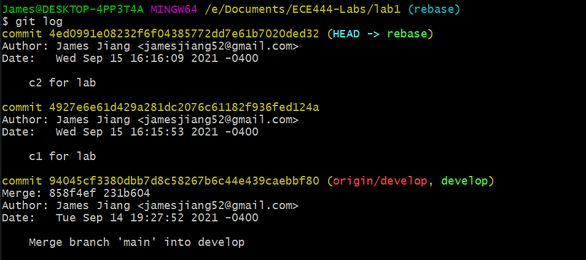
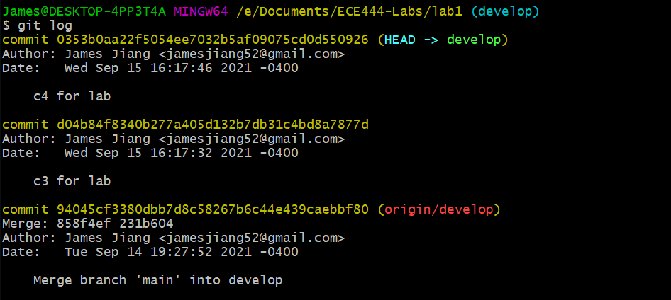
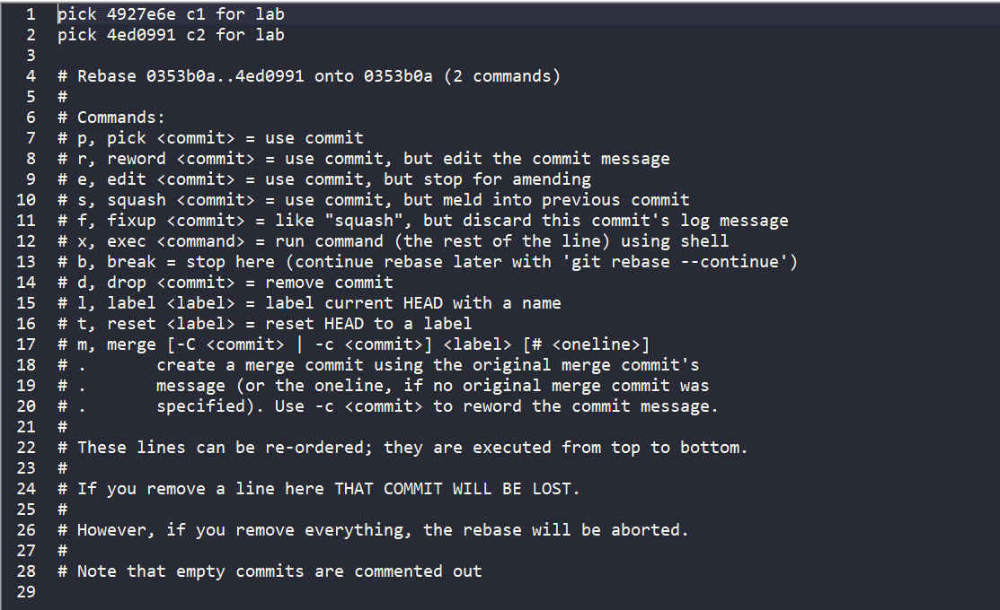
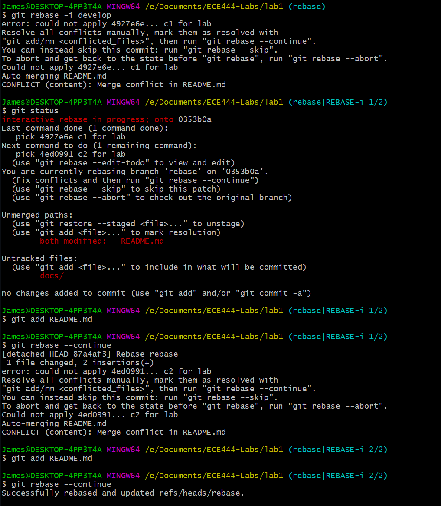
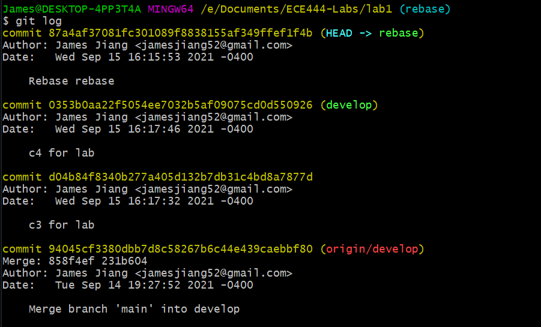

# ECE444-Lab1

James Jiang

## Activity 4

Teammate's repo:
https://github.com/AndyJiang99/ECE444-Lab1

## Activity 5
I committed c1 and c2 to the rebase branch:

Then committed c3 and c4 to the develop branch:

I ran an interactive rebase command on the rebase branch, which opened up this text editor window:

There were a number of merge conflicts (because the commits all changed the same lines); this is the entire output of the rebase command:

Commits c3 and c4 show up in the history of the rebase branch now:

